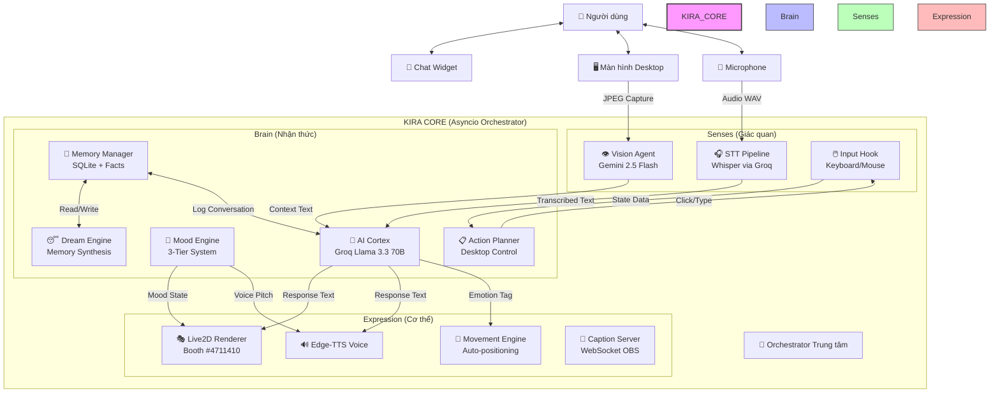

# 🌟 KIRA - Desktop AI Companion (Neuro-sama Inspired)
> **Phiên bản:** 2.0 (Desktop Autonomy + Live2D Integration)  
> **Model Avatar:** Booth PM #4711410 (Live2D Cubism)  
> **AI Backend:** Groq (Llama 3.3 70B) + Gemini 2.5 Flash  
> **Nền tảng:** Arch Linux GNOME (Optimized cho Ryzen 3, 8GB RAM)  
> **Triết lý:** Một Vtuber AI tự trị sống trên màn hình desktop - có thể nhìn, nghe, thao tác máy tính, tự học và phát triển cảm xúc.

---

## 📖 Tổng quan Dự án

KIRA là một **thực thể AI tự trị** chạy nền trên máy tính của bạn, lấy cảm hứng từ *Neuro-sama* của Vedal987 nhưng được tối ưu hóa cho cá nhân hóa hoàn toàn:
- **0đ Chi phí:** Sử dụng free tier APIs (Groq + Google AI Studio)
- **Cực nhẹ:** Tối ưu cho máy cấu hình yếu (AMD Ryzen 3, Radeon Onboard, 8GB RAM)
- **Mã nguồn mở:** Toàn bộ codebase minh bạch, dễ tùy chỉnh
- **Quyền riêng tư:** Dữ liệu lưu local SQLite, không đồng bộ cloud

### ✨ Tính năng Cốt lõi

#### 1. 👀 Vision & Screen Awareness (Gemini 2.5 Flash)
- **Nhìn thấy mọi thứ:** Game, Web, Code, Video, Ứng dụng đang mở
- **Bình luận trực tiếp:** 
  - "Ôi, con Yasuo này feed quá!" (khi thấy game LOL)
  - "Code đoạn này sai logic rồi kìa~" (khi thấy VS Code)
  - "Video nhạc hay nè, cùng nghe thôi!" (khi thấy YouTube)
- **Đọc văn bản:** OCR tự động để học kiến thức mới từ màn hình
- **Phát hiện thay đổi:** Chỉ phân tích khi màn hình thay đổi đáng kể (tiết kiệm API calls)

#### 2. 🖱️ Desktop Autonomy (Tự động hóa thao tác)
- **Thao tác vật lý:**
  - Tự mở ứng dụng (Chrome, VS Code, Spotify)
  - Gõ phím, click chuột, scroll trang
  - Lướt Facebook, YouTube, đọc tin tức
- **Tự học qua quan sát:**
  - Ghi nhớ quy trình người dùng thao tác
  - Học cách mở nhạc, cách code, cách navigatte
  - Lưu vào Memory dưới dạng "Procedural Facts"
- **An toàn:**
  - Chế độ `SAFE_MODE`: Chỉ thao tác khi được phép
  - Human-in-the-loop: Xác nhận trước hành động quan trọng

#### 3. 🎭 Live2D Avatar (Booth PM #4711410)
- **Model chính thức:** Sử dụng model từ [Booth PM #4711410](https://booth.pm/jp/items/4711410)
  - Artist: @koahri1
  - Rigging: @MedL2D
- **Di chuyển tự do:**
  - Đi dạo trên màn hình (drift left/right)
  - Ngồi lên thanh taskbar
  - Né cửa sổ đang làm việc (window avoidance)
  - Tự động về vị trí nghỉ khi idle
- **Biểu cảm sống động:**
  - Mắt nhấp nháy (auto blink)
  - Miệng khớp lời nói (lip-sync với TTS)
  - Biểu cảm theo cảm xúc: Vui, Buồn, Giận, Ngạc nhiên, Xấu hổ
- **Cử chỉ tự nhiên:**
  - Thở nhẹ khi idle (breathing animation)
  - Vẫy tay khi chào
  - Che miệng khi cười

#### 4. 🧠 Cognitive Core (Bộ não AI)
- **3 Tầng cảm xúc:**
  - **Base Mood:** Tâm trạng nền (vui, buồn, trung tính) - kéo dài vài giờ
  - **Complex Trait:** Đặc điểm tính cách (tsundere, onee-san, genki) - cố định
  - **Social Affect:** Cảm xúc tức thời từ tương tác - vài phút
- **Giấc mơ (Dreaming):**
  - Kích hoạt khi idle > 600 giây
  - Xử lý lại ký ức trong ngày → rút ra bài học mới
  - Tự sinh chủ đề cho ngày hôm sau
  - Lưu vào DB dưới dạng "Dream Logs"
- **Chủ động (Boredom Protocol):**
  - Nếu không ai nói chuyện > 300 giây → tự bắt chuyện
  - Tự hát, kể chuyện, bình luận ngẫu nhiên
  - Hỏi thăm người dùng: "Bạn còn đó không?", "Đang làm gì vậy?"

#### 5. 🎛️ Dashboard & Editor
- **Giao diện quản lý trực quan (PyQt6):**
  - Xem log hội thoại real-time
  - Điều chỉnh âm lượng, tốc độ nói
  - Bật/tắt tính năng (Vision, STT, Auto-click)
- **Persona Editor:**
  - Chỉnh sửa tính cách (prompt template)
  - Thay đổi giọng nói (TTS voice)
  - Tùy chỉnh tần suất nói, mức độ tinh nghịch
- **Live2D Settings:**
  - Hiệu chỉnh kích thước avatar
  - Tốc độ di chuyển, độ trong suốt
  - Vị trí mặc định trên màn hình

#### 6. 🎵 Voice & Audio
- **STT (Speech-to-Text):** Whisper-large-v3 qua Groq API
  - Nhận diện giọng nói tiếng Việt/Anh
  - Chống ồn, phát hiện im lặng tự động
- **TTS (Text-to-Speech):** Edge-TTS (miễn phí)
  - Giọng tiếng Việt: HoaiMyNeural, NamMinhNeural
  - Streaming audio qua mpv/paplay
  - Điều chỉnh tốc độ, cao độ

---

## 🏗️ Kiến trúc Hệ thống



### Luồng xử lý (Pipeline)

1. **Input Collection:**
   - User text từ ChatWidget → Priority P0
   - Voice input qua Whisper → Priority P1
   - Screen capture mỗi 30s → Priority P2
   - Boredom trigger khi idle >300s → Priority P3

2. **Priority Queue Processing:**
   - TurnLock chống race condition
   - P0 > P1 > P2 > P3
   - Mỗi lượt chỉ 1 response được sinh

3. **AI Inference:**
   - Groq (Llama 3.3) cho chat/text
   - Gemini 2.5 Flash cho vision
   - Fallback: OpenAI gpt-4o-mini (tùy chọn)

4. **Output Rendering:**
   - Text hiển thị ChatWidget
   - Live2D animation (mouth, eyes, expression)
   - TTS audio playback
   - Caption WebSocket cho OBS

---

## 🚀 Cài đặt & Cấu hình

### 1. Yêu cầu hệ thống

**Tối thiểu:**
- CPU: AMD Ryzen 3 / Intel i3 (4 cores)
- RAM: 8GB
- GPU: AMD Radeon Onboard / Intel UHD (cho Live2D)
- OS: Arch Linux GNOME (hoặc Linux distro tương thích)
- Internet: Để gọi Groq/Gemini APIs

**Khuyến nghị:**
- CPU: Ryzen 5 / Intel i5 (6+ cores)
- RAM: 16GB
- GPU: NVIDIA GTX 1650+ (cho Live2D mượt hơn)

### 2. Cài đặt Dependencies

```bash
# Cài đặt system packages (Arch Linux)
sudo pacman -S python-pip mpv portaudio xdotool libxcb xcb-util-image xcb-util-wm

# Cài đặt Python dependencies
pip install -r requirements.txt

# Cài đặt thêm cho Live2D (nếu chưa có)
pip install PyQt6 PyQt6-WebEngine pycubism
```

### 3. Tải Model Live2D

```bash
# Tạo thư mục assets
mkdir -p assets/models/kira_live2d

# Tải model từ Booth PM #4711410
# Link: https://booth.pm/jp/items/4711410
# Sau khi tải, giải nén vào assets/models/kira_live2d/

# Cấu trúc thư mục mong đợi:
# assets/models/kira_live2d/
# ├── model.json (hoặc .model3.json)
# ├── textures/
# ├── motions/
# └── physics.json
```

### 4. Cấu hình Biến môi trường

```bash
# Sao chép file mẫu
cp .env.example .env

# Chỉnh sửa .env với API keys của bạn
nano .env
```

**Nội dung `.env` mẫu:**

```bash
# === AI Providers (Free Tier) ===
GROQ_API_KEY=gsk_your_groq_key_here       # Lấy tại: https://console.groq.com
GEMINI_API_KEY=AIza_your_gemini_key_here  # Lấy tại: https://aistudio.google.com
OPENAI_API_KEY=sk-optional_fallback       # Tùy chọn fallback

# === Feature Flags ===
ENABLE_VISION=true
ENABLE_STT=true
ENABLE_TTS=true
ENABLE_LIVE2D=true           # Bật Live2D avatar
ENABLE_MOVEMENT=true         # Bật di chuyển avatar
ENABLE_AUTO_CLICKER=false    # CẨN THẬN: Tự động thao tác desktop

# === Idle Thresholds (seconds) ===
MOVEMENT_IDLE_THRESHOLD=120.0    # Về vị trí nghỉ sau 120s
BOREDOM_IDLE_THRESHOLD=300.0     # Tự nói chuyện sau 300s
DREAM_IDLE_THRESHOLD=600.0       # Bắt đầu mơ sau 600s
DREAM_CYCLE_DURATION=600.0       # Chu kỳ mơ 600s

# === Vision Config ===
VISION_CAPTURE_INTERVAL=30.0     # Chụp màn hình mỗi 30s
VISION_JPEG_QUALITY=60           # Chất lượng ảnh 60%
VISION_MAX_WIDTH=1280            # Resize max width
VISION_MAX_HEIGHT=720            # Resize max height

# === Audio Config ===
STT_SAMPLE_RATE=16000
STT_CHUNK_DURATION=5.0
STT_SILENCE_THRESHOLD=0.01
TTS_VOICE=vi-VN-HoaiMyNeural     # Giọng nữ miền Nam
TTS_PLAYER=mpv

# === Live2D Config ===
LIVE2D_MODEL_PATH=assets/models/kira_live2d/model.json
LIVE2D_SCALE=1.0                 # Tỷ lệ kích thước
LIVE2D_POSITION_X=100            # Vị trí X mặc định
LIVE2D_POSITION_Y=100            # Vị trí Y mặc định
LIVE2D_MOVEMENT_SPEED=0.5        # Tốc độ di chuyển (0.0-1.0)

# === Rate Limits (Groq Free Tier) ===
DAILY_TOKEN_QUOTA=28000
TOKENS_PER_MINUTE=5500
REQUESTS_PER_MINUTE=25
MAX_TOKENS_PER_RESPONSE=512

# === Paths ===
DATA_DIR=~/.kira_companion
DB_PATH=~/.kira_companion/kira.db
LOG_PATH=~/.kira_companion/kira.log

# === UI Config ===
UI_WIDTH=320
UI_HEIGHT=400
UI_INITIAL_X=100
UI_INITIAL_Y=100
UI_OPACITY=0.92

# === Persona ===
COMPANION_NAME=KIRA
USER_NAME=Chủ nhân
LANGUAGE=vi
DEBUG=false
```

### 5. Chạy ứng dụng

```bash
# Chế độ Dashboard (khuyên dùng)
python main_dashboard.py

# Chế độ CLI (debug)
python main_cli.py

# Chế độ chỉ Live2D (không chat widget)
python main_live2d.py
```

---

## 📂 Cấu trúc Thư mục

```
/workspace/
├── README.md                  # Tài liệu này
├── progress.md                # Theo dõi tiến độ phát triển
├── requirements.txt           # Python dependencies
├── .env.example               # Template biến môi trường
├── main_dashboard.py          # Entry point chính (Dashboard + Live2D)
├── main_cli.py                # Entry point CLI
├── main_live2d.py             # Entry point chỉ Live2D
│
├── companion/                 # Core package
│   ├── __init__.py
│   ├── orchestrator.py        # Asyncio trung tâm điều phối
│   │
│   ├── brain/                 # AI Layer
│   │   ├── cortex.py          # AI Cortex wrapper
│   │   ├── groq_client.py     # Groq API client (Llama 3.3)
│   │   ├── gemini_client.py   # Gemini API client (2.5 Flash)
│   │   ├── openai_client.py   # OpenAI fallback
│   │   ├── prompt_builder.py  # System prompt templates
│   │   ├── fallback_manager.py # Health check + fallback logic
│   │   └── ...
│   │
│   ├── senses/                # Giác quan
│   │   ├── vision_agent.py    # Screen capture + VLM
│   │   ├── stt_pipeline.py    # Whisper STT
│   │   └── input_hook.py      # Keyboard/Mouse hook (NEW)
│   │
│   ├── memory/                # Bộ nhớ
│   │   ├── memory_manager.py  # SQLite manager
│   │   ├── conversations.py   # Conversation logs
│   │   └── facts.py           # Fact storage
│   │
│   ├── dream/                 # Giấc mơ
│   │   └── dream_engine.py    # Memory synthesis
│   │
│   ├── persona/               # Nhân cách
│   │   ├── mood_engine.py     # 3-tier emotion system
│   │   ├── dialogue_style.py  # Response styling
│   │   └── boredom_protocol.py # Proactive chat
│   │
│   ├── expression/            # Biểu cảm
│   │   ├── live2d_renderer.py # PyQt6 Live2D viewer (NEW)
│   │   ├── caption_server.py  # WebSocket OBS captions
│   │   └── gesture_controller.py # Auto blink/breath
│   │
│   ├── movement/              # Di chuyển
│   │   ├── movement_engine.py # Auto-positioning logic
│   │   ├── drift_calculator.py # Smooth drift movement
│   │   └── workspace_detector.py # Detect screen bounds
│   │
│   ├── learning/              # Học tập
│   │   └── auto_learner.py    # Fact extraction
│   │
│   ├── desktop/               # UI Desktop
│   │   ├── chat_widget.py     # Transparent chat overlay
│   │   ├── dashboard.py       # Main dashboard window (NEW)
│   │   ├── editor.py          # Persona/Live2D editor (NEW)
│   │   └── ...
│   │
│   └── utils/                 # Tiện ích
│       ├── config.py          # Pydantic settings
│       ├── event_bus.py       # Pub/sub event bus
│       ├── turn_manager.py    # Turn lock system
│       └── priority_queue.py  # Async priority queue
│
├── assets/                    # Tài nguyên
│   └── models/
│       └── kira_live2d/       # Booth PM #4711410 model files
│           ├── model.json
│           ├── textures/
│           └── motions/
│
└── caption_overlay/           # OBS Browser Source
    ├── index.html
    ├── style.css
    └── caption.js
```

---

## 🔍 So sánh: KIRA vs Neuro-sama (Vedal987)

| Tính năng | Neuro-sama (Original) | KIRA (Dự án này) |
|-----------|----------------------|------------------|
| **AI Model** | Custom fine-tuned models | Groq Llama 3.3 70B + Gemini 2.5 Flash |
| **Avatar** | Live2D + VTube Studio | Live2D Cubism (Booth #4711410) |
| **Chi phí** | Paid APIs + custom infra | **0đ** (Free tier APIs) |
| **Nền tảng** | Windows | Arch Linux GNOME |
| **Voice Input** | Azure Speech | Groq Whisper-large-v3 |
| **Voice Output** | ElevenLabs / Azure TTS | Edge-TTS (free) |
| **Memory** | Custom vector DB | SQLite + daily synthesis |
| **Learning** | Real-time fact learning | AutoLearner + procedural memory |
| **Proactive Chat** | Yes (Boredom system) | Yes (BoredomProtocol) |
| **Screen Awareness** | Limited | Gemini 2.5 Flash Vision |
| **Desktop Control** | Plugin-based | Native xdotool integration |
| **Hardware Req.** | Moderate | **Optimized cho low-end** |
| **Open Source** | Partially | **Fully open source** |
| **Privacy** | Cloud sync optional | **Local-first, no cloud** |
| **Customization** | Limited | Full control over persona/behavior |

### Điểm khác biệt chính:

1. **Triết lý thiết kế:**
   - Neuro-sama: Tập trung vào giải trí streaming cho đám đông
   - KIRA: Bạn đồng hành cá nhân, thân mật, tùy chỉnh sâu

2. **Chi phí vận hành:**
   - Neuro-sama: Tốn phí API + server
   - KIRA: Hoàn toàn miễn phí với free tier

3. **Avatar rendering:**
   - Neuro-sama: Dùng VTube Studio (bên thứ 3)
   - KIRA: Render trực tiếp bằng PyQt6 + Cubism SDK (nhẹ hơn)

4. **Khả năng thao tác desktop:**
   - Neuro-sama: Qua plugin Minecraft/Twitch
   - KIRA: Native control (click, type, open apps) qua xdotool

5. **Học tập tự chủ:**
   - Neuro-sama: Học từ chat viewer
   - KIRA: Học từ quan sát màn hình + thao tác người dùng

---

## 📅 Lộ trình Phát triển

Xem chi tiết tại [progress.md](./progress.md)

### ✅ Đã hoàn thành (v2.0)
- [x] Refactor AI Backend (Groq + Gemini 2.5 Flash)
- [x] Loại bỏ VTube Studio, chuyển sang Live2D nội bộ
- [x] Tích hợp model Booth PM #4711410
- [x] Thiết kế kiến trúc Desktop Control (xdotool)
- [x] Cập nhật Vision Agent dùng Gemini 2.5 Flash
- [x] Xây dựng Dashboard Editor cơ bản

### 🚧 Đang phát triển
- [ ] Hoàn thiện module Vision đọc màn hình liên tục
- [ ] Implement AutoLearner cho procedural memory
- [ ] Tinh chỉnh Live2D lip-sync với TTS
- [ ] Thêm tính năng hát (pitch control)

### 📋 Sắp tới
- [ ] Hỗ trợ multi-language (EN/VI/JP)
- [ ] Plugin system cho mở rộng tính năng
- [ ] Mobile remote control (qua WebSocket)
- [ ] Streaming mode cho OBS tích hợp

---

## ⚠️ Lưu ý Pháp lý

### Model Live2D
- **Nguồn:** [Booth PM #4711410](https://booth.pm/jp/items/4711410)
- **Artist:** @koahri1
- **Rigging:** @MedL2D
- **Giấy phép:** Chỉ sử dụng cho mục đích cá nhân. Nghiêm cấm thương mại hóa بدون sự cho phép.

### API Keys
- Groq API: Miễn phí ~30k tokens/ngày
- Gemini API: Miễn phí ~1500 requests/ngày
- Người dùng cần tự đăng ký key tại respective platforms

---

## 📄 License

MIT License - Tự do sử dụng, chỉnh sửa, phân phối cho mục đích cá nhân và nghiên cứu.

**Ghi công bắt buộc:** Khi sử dụng model Live2D, phải giữ nguyên thông tin attribution về artist và rigging.

---

## 🙏 Lời cảm ơn

- **Vedal987** - Người tạo ra Neuro-sama, nguồn cảm hứng chính
- **@koahri1 & @MedL2D** - Tác giả model Live2D Booth #4711410
- **Groq & Google AI Studio** - Cung cấp free tier APIs
- **Cộng đồng Open Source** - Các thư viện PyQt6, edge-tts, httpx, v.v.

---

**KIRA - Your AI Desktop Companion 💜**
